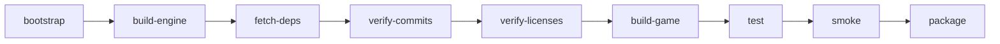

# Phase 9 — Multiplayer + Hardening (server-authoritative, shippable)

Depends on: Phase 8 green. Builds on Phases 2–8 engine/game work.

## Goal

Server-authoritative multiplayer is **viable and shippable**: two players can run a dungeon together on a fresh Linux or Windows package without installing Luanti or any dev tooling, with cheating-resistant validation, working parties/trading, and a CI pipeline that gates every merge.

## Non-goals

- New classes, skills, zones, bosses, or content beyond what Phases 3–8 deliver.
- Launcher, auto-updater, mod browser, or account system.
- Voice chat, cross-platform play between different engine versions, or official dedicated-server hosting.
- Client-side prediction/reconciliation beyond basic input ack (deferred to post-Phase 9 polish).
- Anti-cheat kernel drivers or obfuscation; server validation only.

## Authority model (inviolable)

The server is the **single source of truth** for all gameplay state. The client is an untrusted renderer/input device.

| Domain | Server owns | Client owns | Spoof case if violated |
|---|---|---|---|
| Character stats | HP, MP, base attributes, derived stats, buffs/debuffs, level, XP | Display, animation state, predicted bar fill | Fake max HP → immortal; fake XP → instant level |
| Inventory | Slot contents, stack counts, durability, bind status | Slot rendering, drag preview | Duplicate items, conjure rare gear, overflow stacks |
| Equipment | Equipped slots, stat contributions, set bonuses | Visual model, tooltip cache | Wear unowned item, bypass level req, phantom stats |
| Quests | Active/completed quests, objectives, progress counters | Objective UI, notification timing | Mark quest done without completing, skip objectives |
| Loot | Drop rolls, chest contents, loot-table seeds | Pickup animation, floating text | Force-drop boss loot, reroll chests client-side |
| Combat validation | Hit registration, damage formula, cooldowns, range/LOS checks | Hit effects, camera shake, sound cues | Instant kill, no-cooldown spam, out-of-range hits |
| Progression | Level-ups, skill unlocks, talent points, achievement flags | Skill icon glow, level-up VFX | Unlock endgame skills at level 1, free respec |
| Currency | Gold/materials balance, transaction ledger | Wallet display, purchase confirmation | Mint gold, negative-price purchases |
| Teleport/movement | Position validation, zone transitions, instance entry | Camera, local interpolation, footstep sounds | Noclip, teleport to locked zones, skip dungeons |
| Trade | Offer contents, confirm handshake, atomic swap, dupe detection | Trade window UI, item tooltips | Dupe via cancel race, swap mismatch, phantom items |

### Per-field spoof cases & required server validation

| Field | Attack vector | Server validation rule | Negative test ID |
|---|---|---|---|
| Damage | Client sends `damage=99999` in hit packet | Recompute damage from attacker stats + weapon + target defense + RNG seed; reject if delta > tolerance | NT-DAMAGE-SPOOF |
| XP gain | Client sends `xp_gained=50000` after kill | Server awards XP based on mob template + party split + modifiers; ignore client value | NT-XP-SPOOF |
| Item grant | Client requests `add_item(rare_sword)` | Only grant via validated loot/drop/quest-reward path; check ownership + stack limits | NT-ITEM-SPOOF |
| Equipment | Client sends `equip(item_id=X)` for unowned item | Verify item exists in sender's inventory + meets level/class/binding rules before equip | NT-EQUIP-SPOOF |
| Quest complete | Client sends `quest_complete(Q123)` | Check all objectives met server-side; reject if any incomplete | NT-QUEST-SPOOF |
| Skill unlock | Client sends `unlock_skill(ultimate)` | Validate level + talent prereqs + point cost; reject unauthorized unlocks | NT-SKILL-SPOOF |
| Teleport | Client sends `position=(boss_room)` without transition | Validate zone adjacency + instance ticket + cooldown; rubber-band on violation | NT-TELEPORT-SPOOF |
| Trade offer | Client modifies offer mid-confirm | Atomic commit: both sides' offers locked at confirm; mismatch → abort + log | NT-TRADE-DUPE |
| Stack overflow | Client sends `stack_count=9999` | Clamp to item template max_stack; reject overflows | NT-STACK-SPOOF |
| Currency spend | Client sends `buy(item, price=-100)` | Validate price >= 0 + sufficient balance + vendor stock; reject negatives | NT-CURRENCY-SPOOF |

### Validation design principles

1. **Never trust client-reported numeric outcomes.** All damage, XP, currency deltas computed server-side.
2. **Idempotent operations.** Every mutation has a server-generated sequence ID; replays are safe.
3. **Atomic transactions.** Trades, loot pickups, and quest completions use DB-level transactions or Lua coroutine locks.
4. **Audit logging.** Every rejected spoof logs `[ARCH-RPG:ANTI-CHEAT]` with player ID, field, expected vs received, timestamp.
5. **Rate limiting.** Per-player action queues with configurable caps (e.g., max 10 trade confirms/sec). Excess → disconnect + ban flag.
6. **Schema enforcement.** All CSM→server packets validated against `game/arch_rpg/mods/core/net/schema.lua` before processing.

## Sync design

### What replicates (server → client)

| State category | Replication rate | Activation range | LOD / priority |
|---|---|---|---|
| Player position/rotation | 20 Hz | Global (same instance) | Full precision within 32 nodes; compressed quantized beyond |
| NPC/mob position/anim | 10 Hz | 48-node radius | Sleep beyond range; wake on enter |
| Combat events (hit/heal/death) | Event-driven | 64-node radius | Always full fidelity; unreliable OK for VFX-only |
| Inventory/equipment changes | Event-driven | Owner only (+ trade partner during window) | Full payload; reliable channel |
| Quest/objective updates | Event-driven | Party members (shared) + owner | Delta-only after initial sync |
| Chat/party messages | Event-driven | Channel scope | Reliable, ordered |
| World state (doors/chests) | Event-driven | 32-node radius | Reliable; persist to map |
| Particle/sound cues | Never replicated | Local client | Triggered by combat/world events |

### Bandwidth budget

- Target: < 50 KB/s per client at 20 Hz with 8 nearby entities.
- Compression: delta + varint encoding for positions; string interning for item/quest IDs.
- Backpressure: drop non-critical LOD updates before dropping combat events.

## Party design

- **Invite:** `/party invite <name>` → server validates both online + not in combat → pending invite stored server-side → recipient accepts/rejects via CSM. No client-to-client invites.
- **Shared quest credit:** Party leader's active quest propagates to members on join. Kill/loot/objective events check party membership server-side; all eligible members receive credit. Max party size: 4.
- **XP split:** Base XP ÷ party_size × (1 + 0.1 × (party_size - 1)). Computed server-side on award. Solo XP unchanged.
- **Loot:** Default free-for-all; party-leader toggle for round-robin (server-enforced rotation). No client-side loot assignment.
- **Disband:** Leader `/party disband` or auto-disband on leader logout. Pending invites expire after 60s.

## Trade design

- **Secure window:** Both players must be within 4 nodes. Server creates trade session with unique ID. Each side submits offer via CSM; server stores immutable snapshot.
- **Confirm handshake:** Both send `trade_confirm(session_id, offer_hash)`. Server verifies hashes match stored snapshots + both confirms received within 30s timeout.
- **Atomic swap:** On double-confirm, server executes single transaction: remove items/currency from both inventories, add to counterparts. Failure → rollback + error to both.
- **Anti-dupe:** Offer snapshot immutable after submit. Cancel invalidates session. No re-offer without new session. All trades logged to `[ARCH-RPG:TRADE]` with full item/currency delta.
- **No client authority:** Client never sends "I gave X". Only "I offer X" (validated against inventory) and "I confirm".

## Multiplayer combat rules

- Hit registration server-side: LOS raycast + range check + cooldown gate before damage calc.
- AoE: server enumerates valid targets in radius; client receives hit list for VFX only.
- Death: server marks entity dead, broadcasts event, triggers loot table roll. Client cannot resurrect self.
- Respawn: server-controlled timer + location. Client shows countdown only.
- Friendly fire: disabled by default; party-toggle stored server-side.

## Packaging layout

Self-contained distribution. **No Luanti install required.** No dev environment.

```text
ArchlastRPG/
├── bin/
│   ├── archlast              # Linux binary (or archlast.exe on Windows)
│   └── archlast-server       # Dedicated server binary (Linux only initially)
├── games/
│   └── arch_rpg/             # Game definition (game.conf, minetest.conf overrides)
├── mods/                     # Pinned, license-verified mods only
│   ├── core/
│   ├── player/
│   ├── classes/
│   ├── combat/
│   ├── items/
│   ├── quests/
│   ├── mobs/
│   └── ui/
├── textures/                 # License-verified texture pack
├── assets/                   # Sounds, models, music (license-verified)
├── LICENSE.txt               # Aggregate license notice
├── README.txt                # Player-facing quickstart (no build instructions)
└── VERSION.txt               # Git describe + build timestamp
```

### Script contracts

| Script | Purpose | Inputs | Outputs | Exit codes |
|---|---|---|---|---|
| `scripts/package.sh` | Build Linux package | None (uses repo state) | `dist/ArchlastRPG-<version>-linux-x86_64.tar.gz` | 0=success, 1=build fail, 2=license fail, 3=test fail |
| `scripts/build-windows.ps1` | Build Windows package | None | `dist\ArchlastRPG-<version>-win64.zip` | Same convention via `$LASTEXITCODE` |
| `scripts/fetch-dependencies.sh` | Fetch pinned deps from `dependencies/mods.lock` | Lock file | Populated `mods/`, `textures/`, `assets/` | 0=clean, 1=network, 2=hash mismatch |
| `scripts/verify-dependencies.sh` | Hash-check fetched deps | Lock file + fetched dirs | Pass/fail report | 0=all match, 1=mismatch |
| `scripts/verify-licenses.sh` | Audit licenses for code/textures/models/sounds | Fetched dirs | SPDX-compatible report | 0=compliant, 1=violation, 2=missing |
| `scripts/test.sh` | Run unit + integration tests | Built binary + mods | JUnit XML + summary | 0=all pass, 1=failures |

All scripts MUST be POSIX shell (except `.ps1`). No hardcoded `/home/user` paths. No internet access during `package.sh` (deps pre-fetched).

## CI pipeline

Ordered stages. Each stage blocks the next. All stages MUST pass for merge.



1. **bootstrap:** `scripts/bootstrap.sh` installs system deps. Records toolchain versions.
2. **build-engine:** `scripts/build-linux.sh` produces `bin/archlast`. Fails on warning-as-error.
3. **fetch-deps:** `scripts/fetch-dependencies.sh` pulls pinned mods/assets. Offline-safe after cache.
4. **verify-commits:** GPG/signature check on submodule + mod repos. Reject unsigned/unpinned.
5. **verify-licenses:** `scripts/verify-licenses.sh` scans all fetched content. Fail on GPL/LGPL incompatibility or missing attribution.
6. **build-game:** Validates `games/arch_rpg/` loads without errors against built engine.
7. **test:** `scripts/test.sh` runs Lua unit tests + server-authority negative tests. Coverage threshold enforced.
8. **smoke:** Headless server + headless client connect, create world, run 30s, exit clean. Log checked for errors.
9. **package:** `scripts/package.sh` produces tarball. Size checked (< 500 MB). Contents verified against manifest.

Windows CI mirrors stages 1–9 using `build-windows.ps1` + PowerShell equivalents. Cross-platform matrix: Ubuntu 22.04 LTS + Windows Server 2022.

## Windows first-class notes

- `build-windows.ps1` uses MSVC + CMake presets. No WSL, no MinGW.
- Package includes VC++ redistributable check script (`bin/check-vcredist.ps1`).
- Paths: all scripts use forward slashes or `$PSScriptRoot`; no backslash assumptions in shared configs.
- Filesystem: case-insensitive awareness. Mods dir names lowercase only.
- Logging: `[ARCH-RPG:*]` and `[ARCH-ENGINE:*]` prefixes preserved; UTF-8 BOM-free logs.
- Testing: same `test.sh` logic ported to `test.ps1`; identical pass/fail criteria.

## Final quality-bar run mapping

Per spec §84, two-player validation:

| Criterion | Verification method | Owner |
|---|---|---|
| Both players progress through dungeon | Manual 2-client run + log correlation | QA |
| Trade completes atomically | Automated NT-TRADE-DUPE + manual confirm | Dev |
| Loot credited correctly | Server log audit + client screenshot | QA |
| Quest credit shared | Party quest test harness | Dev |
| No desync after 30 min | Position/state hash comparison | QA |
| Fresh package boots | Clean VM smoke test | CI |
| Cheating attempts blocked | Full negative-test suite | Dev |
| Performance ≥ 30 FPS both clients | Profiling run on min-spec hardware | QA |

## Risks & mitigations

| Risk | Likelihood | Impact | Mitigation |
|---|---|---|---|
| Cheating bypasses validation | Medium | High | Negative-test suite + audit logging + community bug bounty post-launch |
| Latency causes combat frustration | High | Medium | Server reconciliation + client-side prediction (post-Phase 9); tune tick rate |
| Package size exceeds target | Medium | Low | Texture compression + optional HD pack + asset dedup |
| Windows build divergence | Medium | High | Shared CMake presets + CI matrix + identical test suite |
| License violation slips through | Low | Critical | Automated SPDX scan + manual review gate + legal sign-off |
| Party/trade edge-case dupes | Medium | High | Atomic transactions + immutable snapshots + fuzz testing |
| CI flakiness blocks merges | Medium | Medium | Retry policy + deterministic seeds + isolated containers |

## Logging conventions

- Server authority events: `[ARCH-RPG:AUTH]`
- Anti-cheat rejections: `[ARCH-RPG:ANTI-CHEAT]`
- Trade lifecycle: `[ARCH-RPG:TRADE]`
- Party lifecycle: `[ARCH-RPG:PARTY]`
- Sync diagnostics: `[ARCH-ENGINE:SYNC]`
- Package/build: `[ARCH-BUILD:*]`

All logs UTC ISO-8601. Structured JSON optional; plain text required for grep compatibility.

## Decisions locked

- Server authority is non-negotiable. No "trust but verify" shortcuts.
- Packaging is self-contained. No runtime dependency on system Luanti.
- Windows is first-class, not afterthought. Same feature parity, same tests.
- Negative tests ship with code. Not optional QA task.
- CI gates are hard. No merging with red stages.